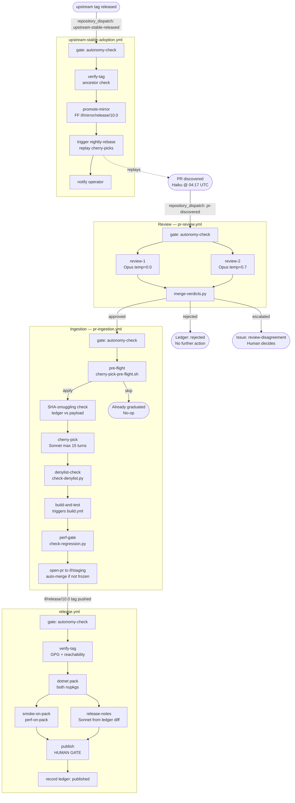

# InitialForce/wpf — Differences from upstream

_Last updated: 2026-04-28 · Branch `if/main` is 24 commits ahead of `upstream/release/10.0`_

---

## TL;DR

- **What it is.** A production fork of `dotnet/wpf` (`release/10.0`) maintained by [Initial Force AS](https://initialforce.com) for internal use. The fork adds zero source-code changes today — its value is the autonomous tooling overlay that will continuously evaluate and cherry-pick high-quality community PRs that are merged into `dotnet/wpf` main but not yet included in the `release/10.0` branch.
- **Why it exists.** Community contributors (notably **h3xds1nz**) regularly merge allocation-reduction, dead-code-removal, and correctness fixes into `dotnet/wpf` main months before they appear in a stable .NET release. This fork provides a way to consume those improvements earlier, under a safety gate, as NuGet packages.
- **How autonomous review works.** Every candidate upstream PR is evaluated independently by two Claude Opus reviewers at different temperatures. Disagreements escalate to a human; unanimous approval triggers cherry-pick, build, smoke, and perf gating before the patch lands.
- **Current operational status.** Phase 0 — bootstrap complete. All workflows, tooling, tests, and the 223-entry patch ledger are committed. The pipeline becomes live once the Phase-0 human gates (GitHub App, branch protection, environments, variables) are configured. Zero patches have been cherry-picked through the automated pipeline yet.
- **All `src/` code is byte-identical to upstream** `dotnet/wpf` `release/10.0` HEAD.

---

## At-a-glance diff stats {#diff-stats}

| Metric | Value |
|---|---|
| Commits ahead of `upstream/release/10.0` | **24** |
| Files changed (M + D + A) | **167** (3 modified, 5 deleted, 159 added) |
| Net lines across modified files | `+16 / −21` (additive in README and .gitignore; reduction in issue template config) |
| Source files modified | **0** — no `src/` changes |
| New fork-only files | **159** |

---

## Modified upstream files {#modified-files}

| File | Change | Rationale |
|---|---|---|
| `.github/ISSUE_TEMPLATE/config.yml` | `+2 / −21` | Removed upstream contact links (dotnet/runtime, winforms, roslyn, etc.) and disabled blank issues; replaced with a stub that routes to fork-specific issue templates. |
| `.gitignore` | `+10 / −0` | Appended a section for Python toolchain artifacts (`__pycache__/`, `.pytest_cache/`, `.venv/`, etc.) needed by the fork's `tools/` scripts. Upstream content untouched. |
| `README.md` | `+4 / −0` | Prepended a 4-line fork banner above a horizontal rule; all upstream content preserved verbatim below it. |

### Deleted upstream files

| File | Upstream lines | Reason for deletion |
|---|---|---|
| `.github/PULL_REQUEST_TEMPLATE.md` | 23 | Upstream contributor template; not applicable — external PRs are processed via the autonomous ingestion pipeline, not standard GitHub PRs. |
| `.github/workflows/backportPRs.yml` | 28 | Upstream backport-bot workflow triggered by `/backport` comments; superseded by `pr-ingestion.yml`. |
| `.github/workflows/locker.yml` | 36 | Upstream stale-issue locker; issue lifecycle is handled differently in the fork (operator templates + autonomous check). |
| `.github/workflows/main.yml` | 13 | Upstream inter-branch merge workflow triggered on `release/**` push; superseded by `build.yml` and `nightly-rebase.yml`. |
| `CODEOWNERS` | 6 | Upstream `@dotnet/wpf-developers` ownership file; replaced by `.github/CODEOWNERS` covering fork-specific paths and `@oysteinkrog`. |

---

## Added: tooling overlay {#tooling-overlay}

The fork adds 159 files across the following categories. No file in this list modifies any upstream WPF source.

| Category | Files | Key files |
|---|---|---|
| **GitHub Workflows** | 11 | `build.yml`, `nightly-rebase.yml`, `pr-discovery.yml`, `pr-review.yml`, `pr-ingestion.yml`, `release.yml`, `upstream-stable-adoption.yml`, `weekly-differential.yml`, `autonomy-check.yml`, `claude-on-failure.yml`, `test-autonomy-check.yml` |
| **GitHub meta** | 5 | `.github/CODEOWNERS`, 4 issue templates (`cherry-pick-failure`, `perf-regression`, `review-disagreement`, `operator-followup`) |
| **Fork config** | 14 | `.if-fork/config.yaml` (canonical policy), `.if-fork/patch-ledger.jsonl`, `.if-fork/patch-state.json`, `.if-fork/prompts/` (10 Claude prompt files) |
| **Python tools** | 19 | `tools/ledger-event.py`, `tools/ledger-validate.py`, `tools/merge-verdicts.py`, `tools/check-regression.py`, `tools/check-denylist.py`, `tools/dispatch-approved.py`, `tools/compute-version.ps1`, and 12 others |
| **Python tests** | 55 | `tests/` — pytest suite; 646 tests covering all `tools/` scripts and workflow contracts, plus fixture data |
| **Smoke + perf harness** | 26 | `test/InitialForce.WpfSmoke/` — 22-scenario NUnit harness + BenchmarkDotNet perf suite + helpers |
| **Hello-world app** | 7 | `test/InitialForce.WpfHelloWorld/` — minimal WPF app used as build and smoke sanity target |
| **NuGet packaging** | 11 | `packaging/InitialForce.WPF/`, `packaging/InitialForce.WPF.RuntimeOverride/` — SDK-style package projects (no source code; wrap fork assemblies) |
| **Documentation** | 8 | `docs/operator-runbook.md`, `docs/DECISION_LOG.md`, `docs/KNOWN_RISKS.md`, `docs/risk-register.md`, `docs/BOOTSTRAP_STATUS.md`, `docs/known-limitations.md`, `docs/manual-candidates.md`, `docs/autonomy-check-usage.md` |
| **Root-level** | 3 | `NOTICE.md`, `pyproject.toml`, `perf/baseline-example.json` |

---

## The autonomous pipeline {#pipeline}

The fork's central capability is a fully autonomous pipeline that discovers candidate community PRs from `dotnet/wpf`, subjects each to a dual-reviewer Claude gate, cherry-picks approved patches onto a staging branch, and builds + smoke-tests them before any code reaches `if/main`. Human intervention is required only for escalations, merge freezes, and NuGet publish approvals.

### Global safety knobs

Three GitHub repository variables control autonomous behaviour. Default safe state has `IF_AUTONOMY_ENABLED=false` and `IF_AUTOMERGE_FROZEN=true`.

| Variable | Effect |
|---|---|
| `IF_AUTONOMY_ENABLED` | Must be `"true"` for any Claude-driven job to run; otherwise all autonomous jobs skip globally (default-deny) |
| `IF_AUTOMERGE_FROZEN` | When `"true"`, blocks auto-merge of cherry-pick PRs — a human must merge manually |
| `IF_REVIEW_DOUBLE_REQUIRED` | Setting to `"false"` activates an emergency single-reviewer path, which requires a manual environment approval and always emits a `review_single_path_warning` ledger event |

Additional safety layers: denylist for supply-chain and high-risk paths (`file_denylist` in `config.yaml`), hard-fail patterns that auto-reject any PR containing `[DllImport`, `unsafe`, `BinaryFormatter`, etc., SHA-smuggling prevention (ledger SHA vs dispatch payload), append-only GPG-signed hash-chained ledger, CODEOWNERS enforcement on policy and release paths, and a mandatory human approval gate at NuGet publish time.

### Stage-by-stage summary

**1. Discovery** (`pr-discovery.yml`, daily 04:17 UTC). A Claude Haiku agent (read-only tools, max 8 turns) scans `dotnet/wpf` for new community PRs, applies tier predicates (S/A/B) from `config.yaml`, and fires a `pr-discovered` dispatch for any new candidates. Denylist and hard-fail checks happen here first.

**2. Dual review** (`pr-review.yml`). Two Claude Opus reviewers run independently (max 12 turns each) — `review-1` at temperature 0.0 (diff only), `review-2` at temperature 0.7 (diff + source context). `tools/merge-verdicts.py` collapses their JSON outputs: both approve → `approved`; either rejects → `rejected`; disagreement or hard-fail → `escalated` (GitHub issue filed, human decides).

**3. Ingestion** (`pr-ingestion.yml`). Eight sequential jobs: autonomy gate → pre-flight check (already absorbed?) → SHA-smuggling check → Claude Sonnet cherry-pick (max 15 turns, with conflict-resolution retry) → denylist re-check on actual diff → build-and-test → perf gate → open PR to `if/staging`.

**4. Build** (`build.yml`). Five job groups on both `x64` and `arm64` Windows runners: Python lint (ruff + mypy --strict + pytest), YAML lint (actionlint), WPF build, 22-scenario NUnit smoke harness, and BenchmarkDotNet perf suite. An `aggregate` job diffs smoke results and fails the run if any required job did not succeed.

**5. Perf gate** (`tools/check-regression.py`). Per-scenario delta versus baseline: ≤5% pass, 5–15% warning, >15% fail (exits non-zero and opens a `perf-regression` issue). Fails closed on zero-baseline or empty comparison.

**6. Release** (`release.yml`). GPG tag verification + ancestor check → `dotnet pack` both NuGet packages → smoke/perf on the packed `.nupkg` → Claude Sonnet release notes from ledger diff → human approval at `wpf-nuget-publish` environment → publish to GitHub Packages → `published` ledger event.

**7. Nightly rebase** (`nightly-rebase.yml`, 03:07 UTC). Fetches `upstream/release/10.0` HEAD, rebases `if/staging`, invokes Claude Sonnet (up to 3 retry attempts) on conflicts, opens a PR to `if/main` for human merge.

**8. Graduation** (`upstream-stable-adoption.yml`). When `dotnet/wpf` publishes a new stable tag, fast-forwards `if/mirror/release/10.0` and re-triggers the nightly rebase. Cherry-picked patches that are now included in the new upstream tag are automatically detected as `skip` on next ingestion.

### End-to-end flow

**Phase-0 note.** The `build-wpf` job currently emits placeholder marker files rather than real `.nupkg` artifacts — the upstream WPF source checkout and `dotnet pack` invocations are `TODO` pending the Phase-0 packaging beads. Smoke and perf steps are similarly wired but produce sentinel outputs only. The orchestration, gating, artifact paths, ledger chain, and Python tooling CI are fully operational.

### Ledger and audit trail

Every pipeline action that changes patch state calls `tools/ledger-event.py`, which constructs a JSONL entry containing the event type, PR number, actor, timestamp, and a `prev_hash` of the previous entry. The entry is appended and committed with a GPG signature. Any retroactive modification of a ledger entry invalidates all subsequent hashes. `tools/ledger-validate.py` verifies the full chain on every `build.yml` run.

Valid event types: `discovered`, `review_1`, `review_2`, `merged_verdict`, `cherry_picked`, `graduated`, `rejected`, `escalated`, `published`, `rebase_failed`, `pre_flight_failed`, `review_single_path_warning`, `autonomy_paused`, `autonomy_resumed`, `failure_analyzed`.

---

## Current state of the patch ledger {#patch-ledger}

**As of 2026-04-28, zero patches have been processed through the automated 2× review gate.** The ledger contains 223 entries, all in the `discovered` state — these are candidates queued for review, not applied patches.

### Event-type summary

| Event type | Count | Meaning |
|---|---|---|
| `discovered` | 223 | All entries — candidates seeded during bootstrap |
| All other types (`review_1`, `approved`, `cherry_picked`, `published`, …) | 0 | Pipeline not yet live |

### Candidate breakdown by tier

| Tier | Definition | Total | Pre-ledger applied | Pending review |
|---|---|---|---|---|
| **S** | Correctness, thread-safety, perf wins | 106 | 36 | 70 |
| **A** | Allocation reduction, dead-code removal | 83 | 41 | 42 |
| **B** | Style, test coverage, infra improvements | 34 | 21 | 13 |
| **Total** | | **223** | **98** | **125** |

The 98 "pre-ledger applied" entries represent PRs that were already applied to `if/main` before the ledger was established. They are in the ledger for audit completeness only; they do not require pipeline processing.

Of the 125 pending candidates, 116 are already merged into `dotnet/wpf` main and 9 are still open there. None are in `upstream/release/10.0` — that is the selection criterion.

### Aggregate line impact of pending candidates

| Scope | Additions | Deletions | Net |
|---|---|---|---|
| All 223 candidates (aggregate) | +30 808 | −64 719 | −33 911 |
| 125 pending (not yet in fork) | +15 355 | −27 046 | −11 691 |

The strongly negative net reflects the dominant theme: dead-code removal and replacing legacy patterns with leaner, allocation-free equivalents.

### Top tier-S/A candidates (pending)

| PR | Tier | Upstream | Net LOC | Title |
|---|---|---|---|---|
| [#9967](https://github.com/dotnet/wpf/pull/9967) | S | MERGED | +10 | Replace ArrayList with List\<T\> in BamlMapTable |
| [#9468](https://github.com/dotnet/wpf/pull/9468) | A | MERGED | −459 | AvTrace: use params ReadOnlySpan\<object\> |
| [#10021](https://github.com/dotnet/wpf/pull/10021) | B | MERGED | −268 | [StyleCleanUp] Add missing accessibility modifiers (IDE0040) |

The overwhelming majority of tracked candidates originate from **h3xds1nz**, a prolific public contributor to `dotnet/wpf`.

### Manual candidates (outside the automated pipeline)

Five patches in [`docs/manual-candidates.md`](docs/manual-candidates.md) have no `dotnet/wpf` PR number (cross-fork sources: Faithlife/wpf, dotnet-campus/wpf) and require direct operator cherry-pick once Phase 0/1 setup is complete. They are not in `.if-fork/patch-ledger.jsonl`.

---

## What is identical to upstream {#identical}

All files under `src/`, `eng/`, and every other WPF runtime path are byte-identical to `dotnet/wpf` `release/10.0` HEAD. The fork ships zero source-code modifications today. Every commit in the 24-commit delta concerns CI/CD workflows, Python test tooling, NuGet packaging metadata, Claude prompts, ledger data, documentation, and root-level config files. No WPF assembly behavior is altered.

---

## License and relationship to upstream {#license}

This fork is distributed under the **MIT License**, the same license as `dotnet/wpf`. The .NET Foundation retains copyright on all upstream source files. See [`NOTICE.md`](NOTICE.md) for the full attribution and legal text.

The fork is not affiliated with or endorsed by Microsoft or the .NET Foundation.

---

## Phase-0 operator gates {#operator-gates}

The following actions require human (operator) intervention before the autonomous pipeline can run. See [`docs/BOOTSTRAP_STATUS.md`](docs/BOOTSTRAP_STATUS.md) for full details and the hand-off recipe.

| Bead | Type | Action required |
|---|---|---|
| wpf-3sm | GitHub admin | Create `InitialForce/wpf` repo; push staging tree as initial commit |
| wpf-13l | GitHub admin | Create `initial-force-wpf-bot` GitHub App and install on the repo |
| wpf-238 | GitHub admin | Branch protection on `if/main`, `if/release/*`, `claude/*` |
| wpf-2lc | GitHub admin | Create environments `bot-credentials`, `wpf-nuget-publish`, `branch-promotion` with reviewer gates |
| wpf-ts4 | GitHub admin | Set repo variables to safe starting state: `IF_AUTONOMY_ENABLED=false`, `IF_AUTOMERGE_FROZEN=true`, `IF_REVIEW_DOUBLE_REQUIRED=true` |
| wpf-3ar | GitHub admin | Create `if/release/10.0` from upstream `v10.0.X` tag |
| wpf-1gn | nuget.org | Reserve `InitialForce.*` package prefix |
| wpf-1pt | Windows CI | Confirm first clean upstream `release/10.0` build green on `windows-latest` |
| wpf-2hh | Operational | Bulk-process 223 candidates through 2× Opus review (~446 Claude invocations) |
| wpf-j79 | Operator | Triage all `review-disagreement` issues to zero |
| wpf-3vk | Operational | Auto-apply approved patches via `pr-ingestion.yml` |
| wpf-2xo | Operator | First `release.yml` run + manual approve at `wpf-nuget-publish` |
| wpf-1o9 | Manual QA | Manual UI smoke against patched DLLs |
| wpf-29a | Manual QA | Validate operator runbook end-to-end |
| wpf-2wi | Operational | Enable cron triggers for autonomous weekly cadence |

---

## Links {#links}

| Resource | Path |
|---|---|
| Bootstrap status and hand-off recipe | [`docs/BOOTSTRAP_STATUS.md`](docs/BOOTSTRAP_STATUS.md) |
| Operator runbook | [`docs/operator-runbook.md`](docs/operator-runbook.md) |
| Legal attribution | [`NOTICE.md`](NOTICE.md) |
| Fork policy (denylist, tiers, thresholds) | [`.if-fork/config.yaml`](.if-fork/config.yaml) |
| Patch ledger | [`.if-fork/patch-ledger.jsonl`](.if-fork/patch-ledger.jsonl) |
| Manual cherry-pick candidates | [`docs/manual-candidates.md`](docs/manual-candidates.md) |
| Known risks | [`docs/KNOWN_RISKS.md`](docs/KNOWN_RISKS.md) |
| Decision log | [`docs/DECISION_LOG.md`](docs/DECISION_LOG.md) |
| PR discovery workflow | [`.github/workflows/pr-discovery.yml`](.github/workflows/pr-discovery.yml) |
| PR review workflow | [`.github/workflows/pr-review.yml`](.github/workflows/pr-review.yml) |
| Build workflow | [`.github/workflows/build.yml`](.github/workflows/build.yml) |
| Release workflow | [`.github/workflows/release.yml`](.github/workflows/release.yml) |
