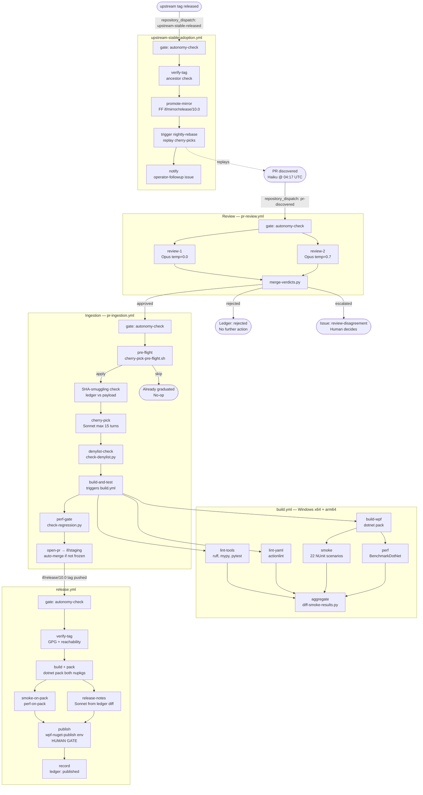

# Autonomous Pipeline Narrative
**Round-2 Agent D — 2026-04-28**

This document traces the full end-to-end operation of the InitialForce/wpf autonomous
pipeline, from discovering a candidate upstream PR to publishing NuGet packages and
graduating cherry-picks once upstream absorbs them.

---

## Overview

The fork runs on GitHub Actions and is driven by Claude AI models via the
`anthropics/claude-code-action@v1` step wrapper. Every stage is gated by a reusable
`autonomy-check.yml` workflow that evaluates three repository variables before any
Claude-driven work proceeds:

| Variable | Effect when set |
|---|---|
| `IF_AUTONOMY_ENABLED` | Must be `"true"`; otherwise **all** autonomous jobs are skipped globally |
| `IF_AUTOMERGE_FROZEN` | Blocks the auto-merge step on cherry-pick PRs (human must merge manually) |
| `IF_REVIEW_DOUBLE_REQUIRED` | Set to `"false"` only to activate an emergency single-reviewer fast path (requires a manual approval environment gate) |

The gate uses default-deny: any unrecognised `requested_action` value is blocked.

---

## Pipeline Stages

### 1. Discovery — `pr-discovery.yml`

**Schedule:** daily at 04:17 UTC (plus `workflow_dispatch`)

The workflow first calls `autonomy-check.yml` with `requested_action: discovery-scan`.
If `IF_AUTONOMY_ENABLED != "true"` the job tree stops immediately.

When the gate passes, a Claude Haiku agent (max 8 turns) is invoked with
`.if-fork/prompts/pr-discovery.md` and read-only GitHub tools
(`mcp__github__list_pull_requests`, `mcp__github__search_pull_requests`). Write tools
(`Edit`, `Write`) are explicitly disallowed. The agent:

- Queries `dotnet/wpf` for recently merged or open community PRs against `release/10.0`
- Applies the tier predicates from `.if-fork/config.yaml` (`S`, `A`, `B`) based on file
  count, LOC delta, and confidence thresholds
- Skips any PR whose changed files overlap the `file_denylist` (supply-chain files,
  high-risk WPF source paths, `.github/**`, `.if-fork/**`)
- Also checks `review_hard_fail_patterns` — any PR containing `[DllImport`, `unsafe`,
  `BinaryFormatter`, etc. auto-fails regardless of tier
- The `author_allowlist` (known trusted contributors) gives a confidence prior but does
  **not** bypass the two-reviewer gate

Discovered PRs are written to `/tmp/discovered-batch.json`. A ledger `discovered` event
is appended to `.if-fork/patch-ledger.jsonl` via `tools/ledger-event.py`. If any new
PRs were found, a `pr-discovered` `repository_dispatch` event fires to trigger review.

### 2. Review — `pr-review.yml`

**Trigger:** `repository_dispatch: pr-discovered` or `workflow_dispatch`

The job topology is: `gate → review-1 ──┐ review-2 ──┘ → merge-verdict`.

**review-1** and **review-2** run **independently** — neither shares output with the
other before the merge step. This independence is the core security property.

| Reviewer | Model | Temperature | Input |
|---|---|---|---|
| review-1 | claude-opus-4-7 | 0.0 | Diff only |
| review-2 | claude-opus-4-7 | 0.7 | Diff + source context |

Each reviewer produces a JSON verdict file at `/tmp/review-N.json`. Both are uploaded
as workflow artifacts and recorded in the ledger (`review_1`, `review_2` events).

`tools/merge-verdicts.py` collapses the two files into one of three outcomes:

- **`approved`** — both reviewers agree the patch is safe; `dispatch-approved.py` fires
  a `pr-ingestion-requested` dispatch
- **`rejected`** — patch is unsafe; ledger records `rejected`, no further action
- **`escalated`** — reviewers disagree or a hard-fail pattern was detected; a
  `review-disagreement` GitHub issue is filed via the issue template and a human must
  decide

If `IF_REVIEW_DOUBLE_REQUIRED == "false"` (emergency only), review-2 is skipped and a
`branch-promotion` environment approval gate is required before merge-verdict runs. A
`review_single_path_warning` ledger event is always emitted when the fast path is used.

### 3. Cherry-Pick / Ingestion — `pr-ingestion.yml`

**Trigger:** `repository_dispatch: pr-ingestion-requested`

The ingestion workflow has eight sequential jobs:

1. **gate** — autonomy kill-switch (`requested_action: cherry-pick`)
2. **pre-flight** — `tools/cherry-pick-pre-flight.sh` checks whether the upstream PR
   was already absorbed into the fork branch; outputs `action: apply | skip | escalate`
3. **sha-smuggling-check** — compares the `head_sha` field in the dispatch payload
   against the SHA recorded in the ledger at review time. A mismatch means someone
   altered the payload after review; the job fails closed and records an `escalated`
   ledger event
4. **cherry-pick** — Claude Sonnet (max 15 turns, `.if-fork/prompts/cherry-pick.md`)
   applies the patch onto a `claude/cherry-pick-pr-<N>` branch off `if/staging`. If
   the cherry-pick fails (conflict), a second Sonnet invocation runs
   `.if-fork/prompts/cherry-pick-conflict-resolution.md` (10 turns). Write tools are
   allowed here (`Bash`, `Edit`); `mcp__github__push_files` is disallowed
5. **denylist-check** — `tools/check-denylist.py` re-checks all files actually changed
   in the cherry-pick branch against `file_denylist` patterns from `config.yaml`
6. **build-and-test** — triggers `build.yml` on the cherry-pick branch and waits for
   completion (polls `gh run list` until run ID is captured)
7. **perf-gate** — downloads `perf-results-*` artifacts from the build run and passes
   them to `tools/check-regression.py` with `--threshold-warn 5 --threshold-fail 15`
   (percent). If a scenario degrades by more than 15 %, a `perf-regression` issue is
   filed and the job fails
8. **open-pr** — opens an internal PR from the cherry-pick branch into `if/staging`,
   emits a `cherry_picked` ledger event, and (unless `IF_AUTOMERGE_FROZEN == "true"`)
   enables auto-merge with a squash strategy

### 4. Build — `build.yml`

**Triggers:** pull_request to `if/main` or `if/staging`, push, `workflow_dispatch`

The build workflow runs five job groups:

| Job | Runner | Purpose |
|---|---|---|
| `lint-tools` | ubuntu-latest | ruff, mypy --strict, pytest (55-file test suite) |
| `lint-yaml` | ubuntu-latest | PyYAML parse check + actionlint on all workflows |
| `build-wpf` (matrix: x64, arm64) | windows-latest | dotnet build of packaging projects + ledger-validate |
| `smoke` (matrix: x64, arm64) | windows-latest | 22-scenario NUnit smoke harness via `test/InitialForce.WpfSmoke/` |
| `perf` (matrix: x64, arm64) | windows-latest | BenchmarkDotNet harness; results uploaded as `perf-<arch>` artifacts |

The `aggregate` job collects all results, runs `tools/diff-smoke-results.py` against a
stored baseline, and fails if any required job did not succeed.

**Phase-0 note:** the `build-wpf` job currently emits placeholder marker files instead
of real `.nupkg` artifacts. The upstream WPF source checkout and actual `dotnet pack`
invocations are marked `TODO` and are wired by separate packaging beads. Smoke and perf
steps are likewise placeholders. The orchestration, gating, artifact upload/download
paths, and Python tooling CI are fully operational.

### 5. Performance Regression Gate — `tools/check-regression.py`

The tool reads two BenchmarkDotNet JSON files (`--current` and `--baseline`), computes
per-scenario deltas for both Mean latency and Allocated bytes, and exits as follows:

- `delta_pct ≤ 5 %` — pass (exit 0)
- `5 % < delta_pct ≤ 15 %` — warning (exit 0, `status: warning` in output JSON)
- `delta_pct > 15 %` — fail (exit 2, opens a `perf-regression` GitHub issue)

These thresholds mirror the values in `.if-fork/config.yaml`
(`regression_threshold_pct: 5.0`, `auto_reject_threshold_pct: 15.0`). The tool also
fails closed on a zero-baseline or empty comparison rather than silently passing.

### 6. Release — `release.yml`

**Trigger:** push of a `if-10.0.*` tag, or `workflow_dispatch` with explicit tag

Release flow:

1. **gate** — autonomy kill-switch (`requested_action: release-publish`)
2. **verify-tag** — validates tag format (`^if-10\.0\..+`), GPG signature (`git tag -v`),
   and that the commit is reachable from `if/release/10.0` (not just `if/main`)
3. **build** — computes NuGet version via `tools/compute-version.ps1`, runs `dotnet pack`
   for both `InitialForce.WPF` and `InitialForce.WPF.RuntimeOverride`
4. **smoke-on-pack** / **perf-on-pack** — install the packed `.nupkg` into a local
   temporary feed and re-run the smoke harness and perf check against the actual
   consumer-facing package
5. **release-notes** — Claude Sonnet reads the ledger diff between the previous and
   current `if-10.0.*` tag and drafts release notes
6. **publish** — gated on the `wpf-nuget-publish` GitHub environment (requires a manual
   approver; only `@oysteinkrog` is configured in CODEOWNERS for this path). SHA-256
   cross-check verifies package integrity before push. Packages are pushed to GitHub
   Packages; a GitHub Release is created with the generated notes
7. **record** — appends a `published` ledger event with tag, version, and commit SHA

### 7. Nightly Rebase — `nightly-rebase.yml`

**Schedule:** daily at 03:07 UTC

1. Fetches `upstream/release/10.0` HEAD SHA
2. Creates a branch `claude/rebase-<YYYYMMDD>` off `if/staging` and attempts
   `git rebase <upstream_sha>`
3. If conflicts arise, invokes Claude Sonnet (max 20 turns) with
   `.if-fork/prompts/resolve-rebase-conflict.md` — up to **3 retry attempts**
4. If all retries exhaust with unresolved conflicts, `rebase_failed` is appended to
   the ledger and a GitHub issue is opened for operator action
5. On success, triggers `build.yml` + smoke (placeholder) on the rebased branch, then
   opens a PR `claude/rebase-<date>` → `if/main` for human merge

The rebase workflow uses the same `release-branch-write` concurrency group as
`upstream-stable-adoption.yml`, preventing simultaneous branch writes.

### 8. Graduation — `upstream-stable-adoption.yml`

**Trigger:** `repository_dispatch: upstream-stable-released` (or `workflow_dispatch`)

When `dotnet/wpf` publishes a new stable tag (e.g. `v10.0.104`):

1. **verify-tag** — checks tag exists on upstream and attempts GPG verification
   (warn-only for upstream tags that may be unsigned)
2. **promote-mirror** — fast-forwards `if/mirror/release/10.0` to the new upstream tag.
   Requires a strict ancestor check; any non-fast-forward condition opens a blocker
   issue and halts the workflow
3. **trigger-rebase** — dispatches `nightly-rebase` against the updated mirror,
   effectively replaying all cherry-picks on top of the new upstream baseline
4. **notify** — opens an `operator-followup` issue summarising the version bump with a
   checklist (monitor rebase, review PRs, verify perf series, close when stable)

After the triggered rebase lands, any cherry-pick PR whose upstream PR is now included
in the new tag is automatically detected as `skip` by the `pre-flight` step on the next
ingestion attempt, preventing double-application.

---

## End-to-End Flow Diagram

---

## Ledger and Audit Trail

Every CI action that touches patch state calls `tools/ledger-event.py`, which:

1. Reads the last line of `.if-fork/patch-ledger.jsonl` and computes its SHA-256 hash
2. Constructs a new JSONL entry containing the event type, PR number, actor, timestamp,
   details JSON, and `prev_hash` referencing the previous entry
3. Appends the entry atomically and creates a **GPG-signed git commit**
4. Retries up to 3 times on non-fast-forward push conflicts

The hash chain means any retroactive modification of a ledger entry invalidates all
subsequent entries. `tools/ledger-validate.py` verifies the chain and is run as a step
in `build.yml` on every build. The ledger is append-only by convention; there is no
delete or rewrite operation.

Valid event types (from `tools/ledger_schema.py`) include: `discovered`, `review_1`,
`review_2`, `merged_verdict`, `cherry_picked`, `graduated`, `rejected`, `escalated`,
`published`, `rebase_failed`, `pre_flight_failed`, `review_single_path_warning`,
`autonomy_paused`, `autonomy_resumed`, `failure_analyzed`.

---

## Safety Controls Summary

| Control | Mechanism | Effect |
|---|---|---|
| Global kill-switch | `IF_AUTONOMY_ENABLED != "true"` | Halts all Claude jobs in every workflow |
| Merge freeze | `IF_AUTOMERGE_FROZEN == "true"` | Blocks auto-merge; human must merge cherry-pick PRs |
| Double-review enforcement | `IF_REVIEW_DOUBLE_REQUIRED` (default: require both) | Single-reviewer fast path requires human environment approval and emits a warning ledger event |
| Denylist | `file_denylist` in `config.yaml` | Auto-escalates any PR touching supply-chain or high-risk files |
| Hard-fail patterns | `review_hard_fail_patterns` | `[DllImport`, `unsafe`, `BinaryFormatter`, etc. trigger automatic `unsafe` verdict |
| SHA-smuggling prevention | Ledger SHA vs dispatch payload | Blocks ingestion if payload SHA differs from SHA recorded at review time |
| Append-only ledger | Hash-chain JSONL + GPG-signed commits | Tampering detectable; every autonomous decision is permanently recorded |
| CODEOWNERS | `.github/CODEOWNERS` | `@oysteinkrog` required to approve changes to policy files, ledger, prompt library, and release/review workflows |
| Human publish gate | `environment: wpf-nuget-publish` | NuGet publish step pauses for manual approval; cannot be bypassed by any repository variable |
| Tag verification | `git tag -v` (GPG) + ancestor check | Releases must be signed and reachable from `if/release/10.0` |
| Perf regression gate | `check-regression.py` | >15 % degradation fails ingestion and opens a `perf-regression` issue |
